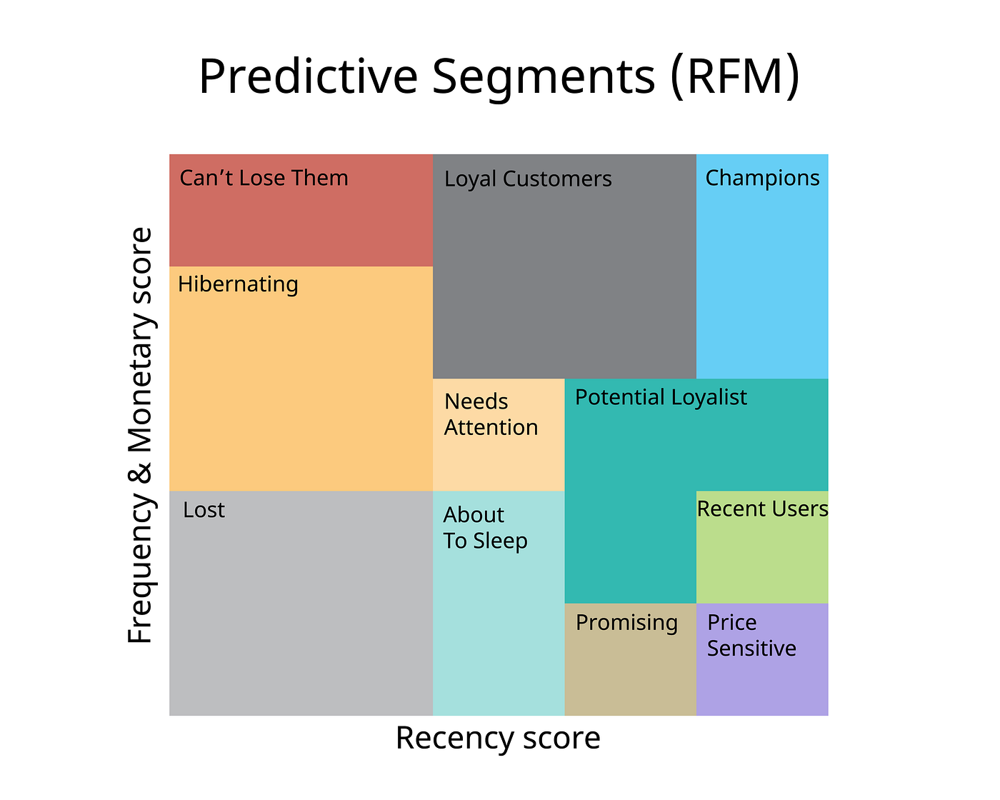
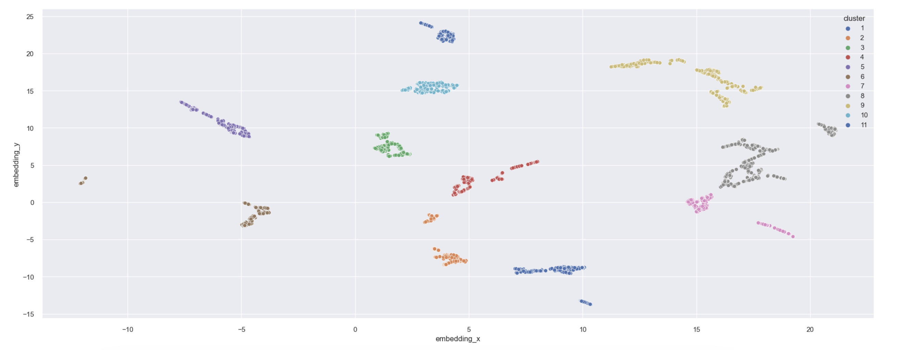
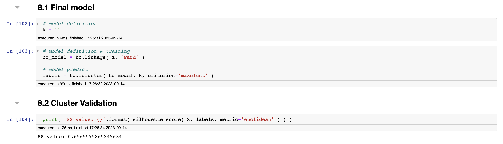

# Customers Clustering Project 🧍🏻

This project has the goal to identify the profile of the most valuable customers to build a loyalty program, based on RFM model.

The RFM model is a customer segmentation technique widely used in marketing that is based on three key metrics:

- Recency: Evaluates how recently a customer interacted or made a purchase. Newer customers receive higher scores.
- Frequency: Measures how often a customer interacts or makes purchases. More frequent customers receive higher scores.
- Monetary Value: Calculates the total amount spent by a customer on purchases. Customers who spend more receive higher scores.

These metrics are used to classify customers into groups based on their individual scores. This segmentation helps companies customize marketing strategies to meet the specific needs of each group, such as Champions (VIP group), At-Risk Customers, New Customers, Loyal Customers, and Low-Value Customers, increasing the effectiveness of marketing campaigns and return on investment.

Data for analysis were made available within the data competitions platform [Kaggle](https://www.kaggle.com/code/cheekonglim/uk-high-value-customers-identification/notebook).

# 1.0 Business Problem
High level Soccer T-shirts is a company that sells second-line branded soccer t-shirts in the outlet model. Having reached the mark of 5000 customers, the marketing team realized that some of them buy high-ticket products, with high frequency, and contribute significantly to the company's revenue. Having identified this opportunity to increase revenue, they decided to create a loyalty program for these customers, called "VIP group". Therefore, they need to create a structure that identifies the profile of the most valuable customers, as well as other customer groups.

Based on the VIP program, the marketing team will take actions aimed at this audience, aiming to increase retention. It will also carry out actions through social networks through targeted advertising, aiming to reach customers with a similar profile, thus increasing the number of customers in the program.

In this sense, the objective is to group the more than 5000 customers into groups by consumption profile, and identify the most valuable customers. In addition, the following business questions must be answered by the marketing area:

- Who are eligible to participate in the Loyals program?
- How many customers will be part of the group?
- What are the main characteristics of these customers?
- What percentage of revenue contribution comes from Loyals?
- What is the expected revenue for this group in the coming months?
- What are the conditions for a person to be eligible for Loyals?
- What are the conditions for a person to be removed from Loyals?
- What is the guarantee that the Loyals program is better than the rest of the base?
- What actions can the marketing team take to increase revenue?

# 2.0 Business Assumptions

- The marketing team needs to view the profiles of each customer group within the Metabase visualization tool, already used by the company.

## 2.1 Data Description

| Column            | Description                                                                                                                             |
| :---------------- | :-------------------------------------------------------------------------------------------------------------------------------------- |
| `InvoiceNo`       | Invoice code |
| `StockCode` | Stock code |
| `Description` | Product description |
| `Quantity` | Quantity of products |
| `InvoiceDate` | Invoice date                                                                                                     |
| `UnitPrice`          | Product price |
| `CustomerID` | Customer id |
| `Country` | Country of the purchase |

# 3.0 Solution Strategy

The strategy uses the CRISP-DS method, which consists of 9 cyclical steps, where at each iteration of the nine steps, the business result is being improved, aiming for increasingly faster deliveries and increasingly more quality and accuracy, thus enabling the teams that will use the developed results have a product that is minimally usable in the first delivery and that is perfected over time.

# 4.0 Insights

## 4.1 Top 3 Insights

**Hypothesis 01: Customers in the VIP cluster have an average of unique products purchased above 10% of total purchases.

**TRUE: 40.20% of unique product volume came from the VIP cluster.

**Hypothesis 02: Customers in the VIP cluster have an average number of returns 10% below the average for the total customer base.

**FALSE: The VIP cluster has an average number of returns 10 times higher than the average for the total customer base.

**Hypothesis 03: The median revenue of the VIP cluster is 10% higher than the median revenue of all clusters.

**TRUE: The median revenue of the Loyals cluster is 275.35% higher than the median revenue of all clusters.

# 5.0 Machine Learning 

Four clustering models were applied: 
- K-Means
- GMM (Gaussian Mixture Model)
- HC (Hierarchical Clustering)
- DBScan
The 4 models were tested considering 2 to 11 possible customer groups (k). Anything above 11 would make the marketing team's work difficult.
These tests were carried out both in the feature space (original data space) and in the embedding space.
The algorithms used to create the embedding spaces were: PCA, UMAP, t-SNE and a tree-based embedding with Random Forest.

Clusters visualization:

## 5.1 Techniques and Performance

The performance of the models was measured using the SS (Silhouette Score) metric, as it is applicable to all clustering models tested.

The best result was obtained with the Hierarchical Clustering ( HC ) model, with k = 11, in the embedding space generated by Tree-Based, with SS = 0.6565.

# 6.0 Business Results

Regarding financial results, we start from the fact that the median revenue of the VIP cluster ( Cluster 6 ) is (2.75x) greater than the median revenue of all clusters, as already explained.With the premise that the High level Soccer T-shirts marketing team, through the project, will increase the number of VIP members by 10% next year, we will have a median increase in revenue of 2.75x in 10% of the base.

- The number of VIP customers in the last year (373 days) is: 214.
- The number of VIP customers expected for next year is: 235.
- We will therefore have 21 new customers.
- Assuming the same median revenue per VIP member, the expected increase in revenue is $85,674.

Cluster VIP ( Champions ) characteristics:

- Customers number: 214 (7,2%)
- Average Gross Revenue: $15332.316
- Average Recency days: 25 days
- Average Purchased Products: 382 products
- Average Frequency: 5%
- Average Returns: 619

# 7.0 Deployment

# 8.0 Conclusions

Based on the business results, it is concluded that the project objective was achieved.

With the data solution delivered, High level Soccer T-shirts now has a robust and profitable VIP program.

Marketing actions aimed at other customer groups can also be carried out, further increasing the reach of the work developed.

The insights report carried out in [Metabase](https://github.com/luishmq/customers_clustering_project/blob/master/reports/Insights_Visualization.pdf) can be viewed by clicking on the hyperlink.

# 9.0 Lessons Learned

- Prioritize tasks and solutions
- Develop solutions in a cyclical way, thus delivering results in a more agile and efficient way
- Learning RFM model fundamentals
- Study of embeddings and clustering methods
- Planning the local and cloud infrastructure
- Connection with RDS AWS Database 

# 10.0 Next Steps

- Create more features from existing ones, seeking to generate more input for learning the models.
- Improve more the model deployment in production.

